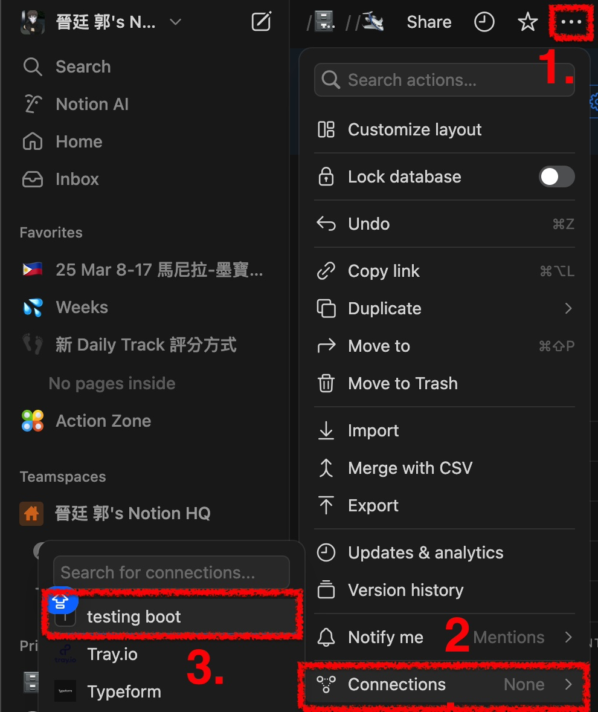
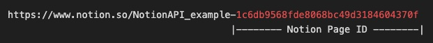

# Notion API 整合工具

這個專案提供了一個簡單且強大的 Python 工具包，用於與 Notion API 進行互動。支持數據庫操作、頁面管理、屬性處理以及圖片上傳等功能。

## 功能特點

- 數據庫操作
  - 創建新數據庫
  - 添加/更新數據庫屬性
  - 查詢數據庫內容
  - 支持多種過濾條件
  - 支持排序功能

- 頁面管理
  - 創建新頁面
  - 更新頁面內容
  - 添加關聯屬性
  - 批量操作頁面

- 圖片處理
  - 支持外部圖片 URL
  - 支持本地圖片上傳（通過 Imgur）
  - 支持圖片說明文字

- 屬性處理
  - 支持多種屬性類型（文本、數字、選擇、多選、日期等）
  - 格式化屬性值輸出
  - 關聯屬性支持

## 安裝

克隆專案：
```bash
!git clone https://github.com/robinkct/notionAPI_example.git
cd notionAPI_example
```

## 配置
1. 獲取必要的認證：
   - NotionAPI Token: 從 [Notion Developers](https://developers.notion.com/) 獲取：[可參考](https://dragonflykuo.com/%e4%b8%b2%e6%8e%a5-notion-api%e7%94%a8-python-%e8%87%aa%e7%94%b1%e6%93%8d%e4%bd%9c-notion/)
   - (Option, 本地上傳圖片才需要) Imgur Client ID: 從 [Imgur API](https://api.imgur.com/oauth2/addclient) 獲取

2. 到 notion/config.py 中新增：
```config.py
NOTION_TOKEN=your_notion_token
IMGUR_CLIENT_ID=your_imgur_client_id
```

3. 打開 Notion 頁面，將第一步申請的 NotoinAPI 與頁面連接


4. 從 Notion 頁面取得頁面 ID，填入 main.py

```
root_page_id = 'your page ID'
```

5. 運行 example: 結果可參考[Notion頁面](https://wiry-timpani-17d.notion.site/NotionAPI_example-1c6db9568fde8068bc49d3184604370f?pvs=74)
```
python example.py
```
